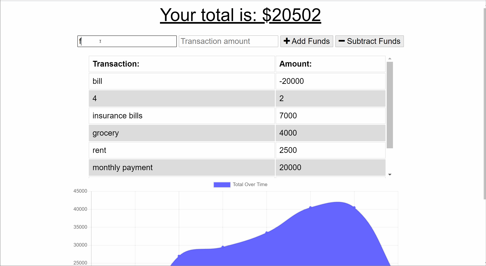

# Budget Tracker Starter Code
Online/Offline Budget Trackers

Using a previously created Budget Tracker application, a user is able to update information while online/offline. Updated application has offline access and functionality.

The user is able to add expenses and deposits to their budget with or without a connection. When entering transactions offline, the total will be populated when brought back online.

Offline Functionality:

* Enter deposits and expenses offline

When brought back online:

* Offline entries added to tracker.

 ## Links 
 https://budget-tracker89.herokuapp.com/
 https://github.com/fadhaa89/Budget-Tracker

  

  ## video /screenshot
  
